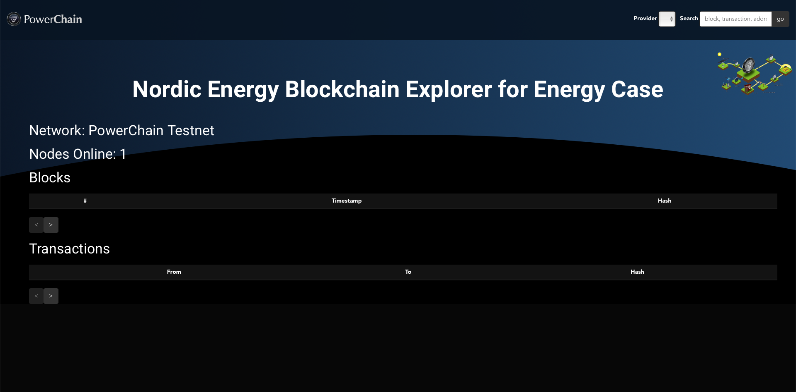

 

Nordic Energy Blockchain Explorer for Energy Case
=====================================

Development environment
-----------------------

start your own node and update `src/config.js`

`npm i`

`npm run serve`

`open http://localhost:8080/`
